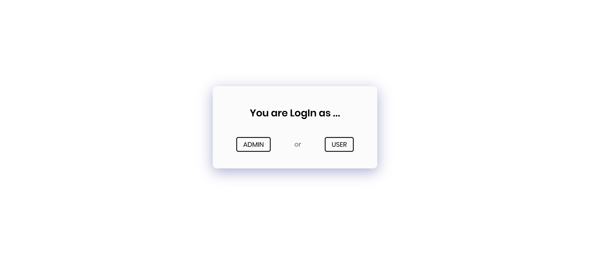
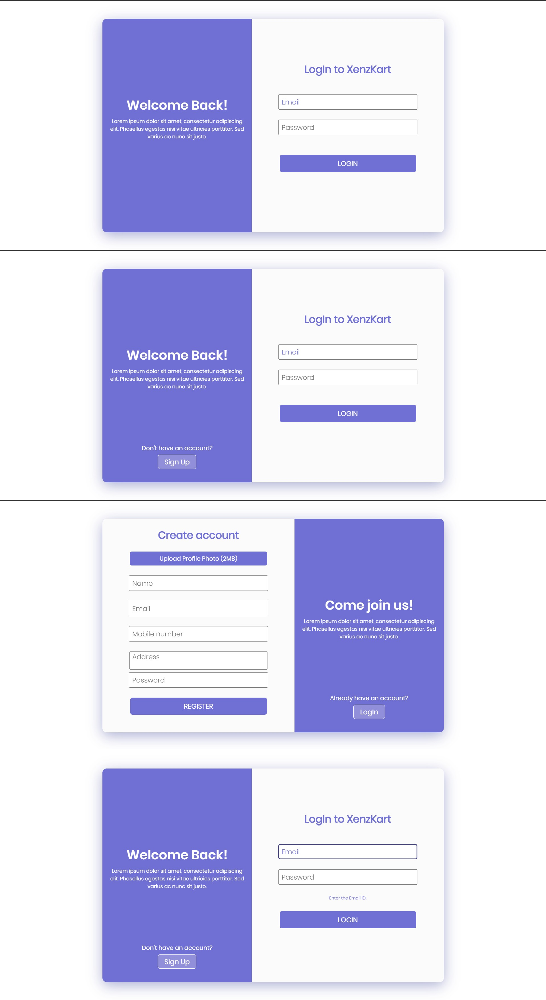
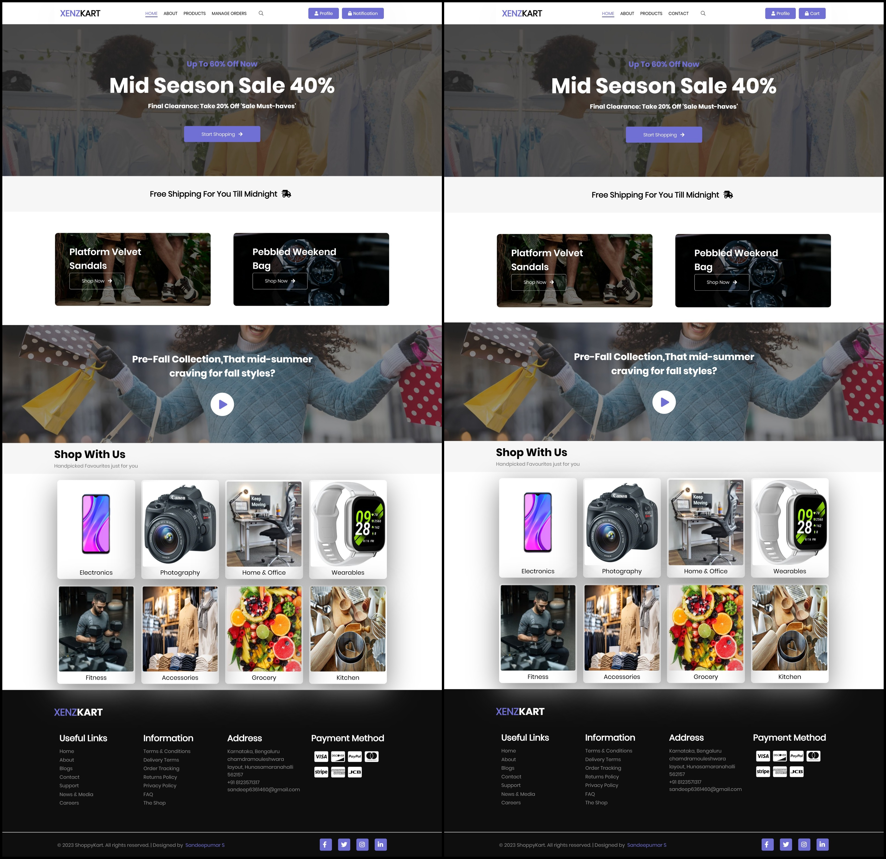
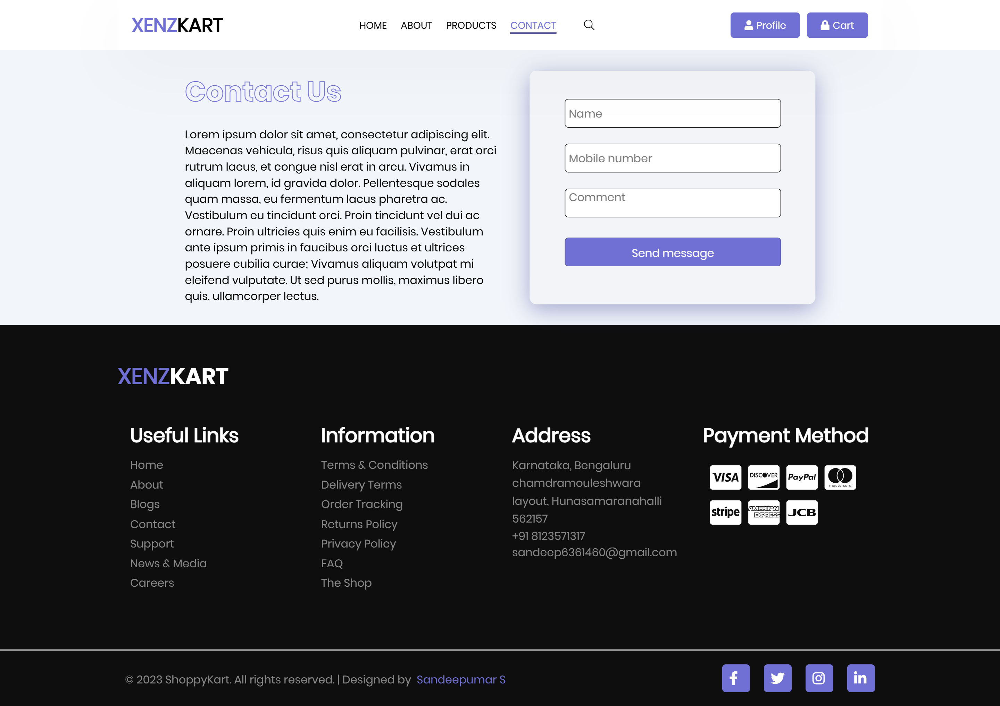
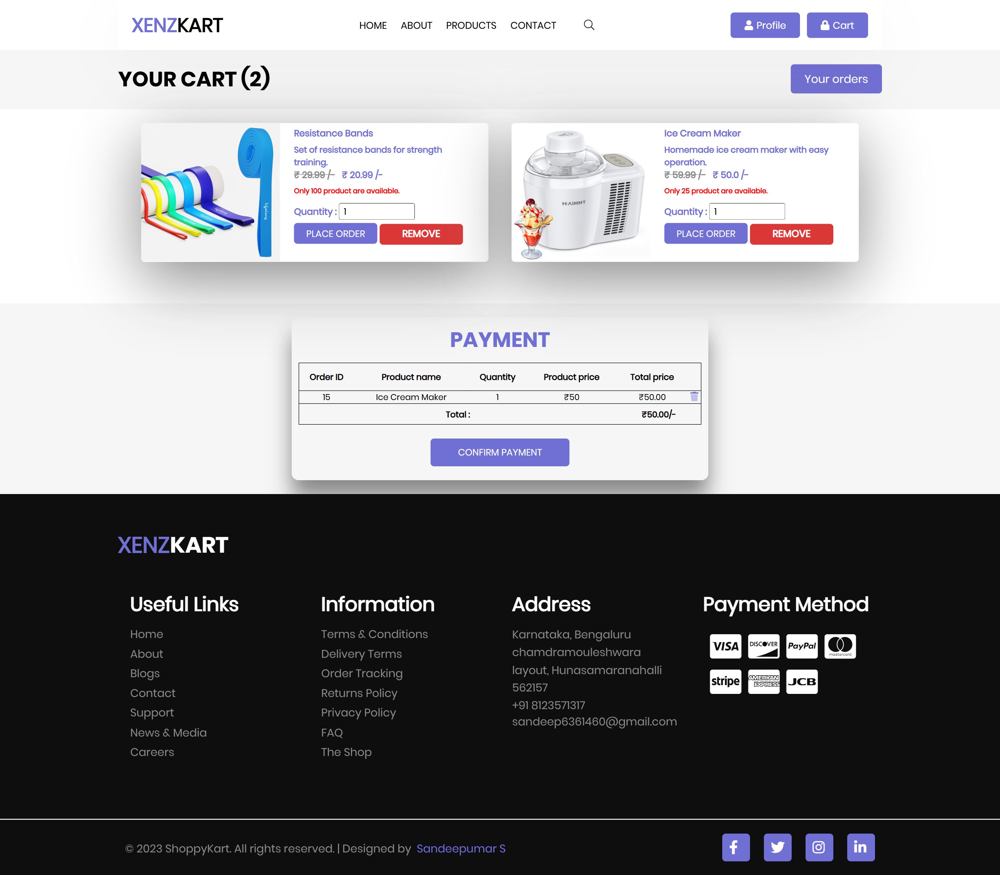
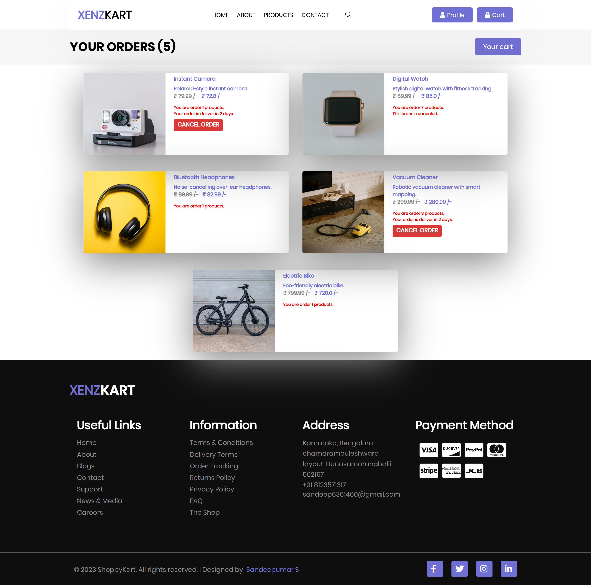
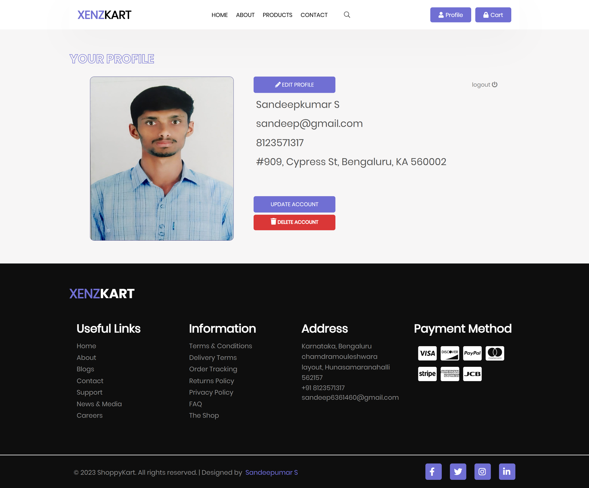
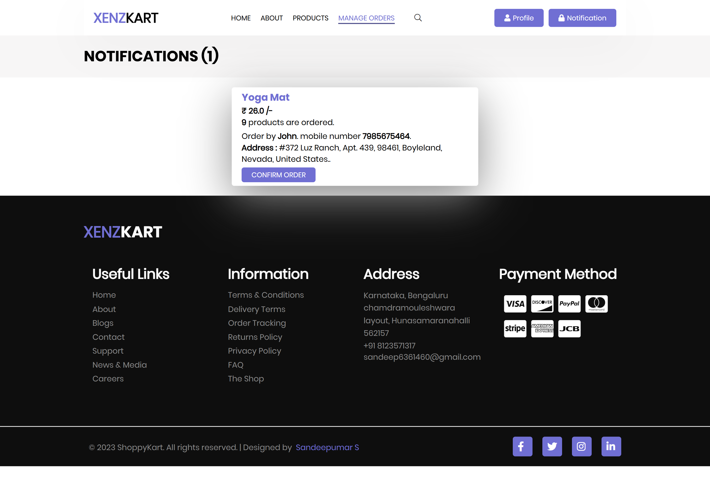

# E-Commerce Web Application - *XenzKart*

**XenzKart** is a full-stack e-commerce web application designed to deliver a seamless shopping experience. Built using **Java, JSP, HTML, CSS, and JavaScript**, XenzKart enables users to browse a diverse range of products, manage their shopping carts, and place orders effortlessly. The application features a user-friendly interface, dynamic product displays, and robust **backend functionality**, making it an ideal platform for online shopping.

---

## 📸 Preview  

### 🏠 **Entry Page**  
  

*The entry page serves as the landing point for users, allowing both users and administrators to select their role before proceeding further in the application.*

### 🔑 **Login/Signup Page**  
  

*This page allows users to log in to their existing accounts or create a new account. While users can register for a new account, administrators do not have this option.*

### 🏢 **Admin and** 🛍️ **User  Home Page**  
 

*The admin home page provides a dashboard for administrators to manage the application, view statistics, and access various functionalities. The user home page showcases featured products and categories, enabling users to navigate the available items easily.*

### ℹ️ **About Page**  
  

### 🛠️ **Admin and** 🏷️ **User  Product Page**  
  

*This page allows administrators to manage product listings, including adding and editing products in the catalog. When logged in as a user, this page displays detailed information about specific products, including images, descriptions, and pricing. Users can also add products to their cart from this page.*

### 📞 **Contact Page**  
  

*The contact page enables users to reach out for support or inquiries, providing a form for easy communication.*

### 🛒 **Cart Page**  
  

*The cart page displays the items users have added to their cart, along with the total price and options to proceed to checkout.*

### 📦 **Order Page**  
  

*The order page presents users with their order history, including details of past purchases and current order statuses.*

### 👤 **Profile Page**  
  

*The profile page allows users to view and edit their account information, including personal details and preferences.*

### 📋 **Manage Orders Page**  
  

*The manage orders page provides administrators with the ability to view and manage customer orders, ensuring efficient order processing.*

---

## 🛠 **Features**

- **User  Registration and Authentication**: Users can create accounts and log in securely to access personalized features.
- **Role-Based Access**: The application supports different roles (user and admin), providing tailored functionalities for each role.
- **Product Browsing**: Users can browse a wide range of products, view detailed descriptions, and see images and pricing.
- **Shopping Cart Management**: Users can add products to their cart, view cart contents, update quantities, and remove items as needed.
- **Order Placement**: Users can place orders directly from their cart, with a streamlined checkout process.
- **Order History**: Users can view their past orders, including details of each purchase and current order statuses.
- **Profile Management**: Users can view and edit their account information, including personal details and preferences.
- **Admin Dashboard**: Administrators have access to a comprehensive dashboard to manage products, view statistics, and oversee user accounts.
- **Product Management**: Admins can add and edit product listings, ensuring the catalog is up-to-date.
- **Order Management**: Admins can view and manage customer orders, facilitating efficient order processing and fulfillment.
- **Contact and Support**: Users can reach out for support or inquiries through a dedicated contact page.
- **User -Friendly Interface**: The application features an intuitive and easy-to-navigate interface, enhancing the overall user experience.

---

## 💻 **Tech Stack**

- **Frontend Technologies**:
  - **HTML**: Provides the semantic structure for web pages, ensuring accessibility and SEO optimization.
  - **CSS**: Utilizes custom styles, grids, and flexbox for responsive design and layout, enhancing the visual appeal of the application.
  - **JavaScript**: Implements core interactivity, including product management, cart operations, and dynamic UI functionality.

- **Backend Technologies**:
  - **Java**: Serves as the primary programming language for server-side logic and application functionality.
  - **JSP (JavaServer Pages)**: Facilitates the creation of dynamic web content by embedding Java code in HTML pages.

- **Database**:
  - **MySQL**: Used for data storage, managing user accounts, product listings, and order information.

- **External Libraries**:
  - [Font Awesome](https://fontawesome.com/): Provides a library of icons for enhancing the user interface, including buttons and navigation elements.

- **Development Tools**:
  - **NetBeans IDE**: The integrated development environment used for coding, debugging, and deploying the application.
  - **Apache Tomcat**: A web server used for deploying the Java web application, providing a runtime environment for JSP and servlets.
  - **GlassFish**: An alternative application server that supports Java EE and provides additional features for enterprise-level applications.

---

## 👨‍💻 Installation

1. Clone this repository:
   ```bash
   git clone https://github.com/Sandeepkumar-S-18/XenzKart--Full-stack-project.git
   ```
2. Navigate to the project directory:
   ```bash
   cd XenzKart--Full-stack-project
   ```
3. Open `index.html` in your web browser to use the XenzKart--Full-stack-project.

---

## 🛍️ **Usage**

### 🖥️ **User  Interface**

1. **Homepage Navigation**:
   - The homepage features a clean layout with easy navigation to various product categories.
   - Users can quickly access featured products and promotions.

2. **Product Management**:
   - Products are organized into categories, allowing users to filter and sort items based on their preferences.
   - Each product card displays essential information, including an image, name, price, and an "Add to Cart" button.

3. **Product Details Page**:
   - Clicking on a product will take users to a dedicated product details page.
   - This page includes comprehensive information such as product specifications, customer reviews, and related products.

4. **Shopping Cart Overview**:
   - Users can view their shopping cart by clicking the cart icon located in the header.
   - The cart displays a summary of selected items, including quantities, individual prices, and the total amount.

### 💳 **Checkout Process**

- When users are ready to finalize their purchase, they can click on the "Checkout" button in the cart.
- The checkout page summarizes the order details, including shipping options and payment methods.
- Users receive a confirmation message via SweetAlert upon successful completion of their order, ensuring a smooth transaction experience.

### 📞 **Customer Support**

- Users can access the contact page for any inquiries or support requests.
- A simple form allows users to submit questions or feedback directly to the support team.

### 👤 **User  Account Management**

- Users can create an account to manage their profile, view order history, and save favorite products.
- The profile page allows users to update personal information and change their passwords.

---

## 📂 Project Structure

Here is an overview of the project structure:

```bash
XenzKart--Full-stack-project/
├── web/
│   ├── index.html
│   ├── Pages/
│   │   ├── home.jsp
│   │   └── ... (other JSP pages)
│   ├── CSS/
│   │   ├── style.css
│   │   ├── ... (other CSS files)
│   │   └── Fonts/
│   │       └── font_templates/
│   ├── js/
│   │   ├── pageJS.js
│   │   └── validation.js
│   ├── Images/
│   │   └── ... (image assets)
│   ├── Product_images/
│   │   └── ... (all product images)
│   ├── Uploads/
│   │   └── ... (user profile photos)
│   └── WEB-INF/
│       └── web.xml
└── src/
    └── java/
        └── com/
            ├── MyDb/
            │   └── JDBC related files
            ├── MyJavaClass/
            │   └── JavaBeans (POJOs)
            └── MyServlets/
                └── Servlet classes
```
