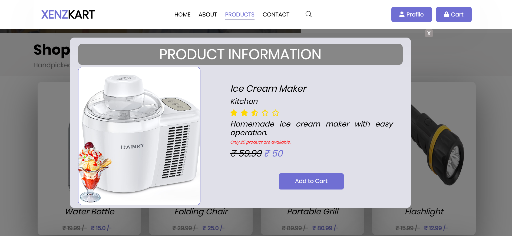
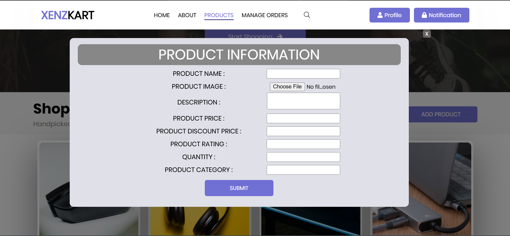

# E-Commerce Web Application - *XenzKart*

**XenzKart** is a full-stack e-commerce web application built using **Java, JSP, HTML, CSS, and JavaScript**, designed to offer a seamless shopping experience. It includes features like dynamic product browsing, shopping cart management, order placement, and an admin dashboard.

---

## 📸 Preview

### 🏠 Entry Page  
  
*Landing page with role selection (User/Admin).*

### 🔑 Login/Signup Page  
  
*User authentication system (Admins cannot sign up).*

### 🏢 Admin & 🛍️ User Home Page  
  
*Dashboard for admins and featured products for users.*

### ℹ️ About Page  
  

### 🛠️ Admin & 🏷️ User Product Page  
  
*Admins manage products; users view product details and add to cart.*

### 🛒 Add to Cart  
  

### ✏️ Modify Product Details  
  

### ➕ Add New Product  
  

### 📞 Contact Page  
  

### 🛒 Cart Page  
  

### 📦 Order Page  
  

### 👤 Profile Page  
  

### 📋 Manage Orders Page  
  

---

## 🛠 Features

- Role-based access (User/Admin)
- Secure login/signup
- Product browsing with detailed views
- Shopping cart with update/delete
- Order placement & history tracking
- Admin dashboard for managing products & orders
- Contact form for support

---

## 💻 Tech Stack

**Frontend**:  
- HTML, CSS (Flexbox/Grid), JavaScript  

**Backend**:  
- Java, JSP  

**Database**:  
- MySQL  

**Tools & Libraries**:  
- NetBeans, Apache Tomcat, GlassFish  
- [Font Awesome](https://fontawesome.com/) for icons

---

## 👨‍💻 Installation

1. Clone this repository:
   ```bash
   git clone https://github.com/Sandeepkumar-S-18/XenzKart--Full-stack-project.git
   ```
2. Navigate to the project directory:
   ```bash
   cd XenzKart--Full-stack-project
   ```
3. Open `index.html` in a browser, or run via NetBeans/Tomcat.

---

## 🛍️ Usage

- Browse products by category
- Add/remove items from the cart
- Place orders with confirmation
- Manage profile and view past orders
- Admin can add/edit/delete products and view all orders

---

## 📂 Project Structure

Here is an overview of the project structure:

```bash
XenzKart--Full-stack-project/
├── web/
│   ├── index.html
│   ├── Pages/
│   │   ├── home.jsp
│   │   └── ... (other JSP pages)
│   ├── CSS/
│   │   ├── style.css
│   │   ├── ... (other CSS files)
│   │   └── Fonts/
│   │       └── font_templates/
│   ├── js/
│   │   ├── pageJS.js
│   │   └── validation.js
│   ├── Images/
│   │   └── ... (image assets)
│   ├── Product_images/
│   │   └── ... (all product images)
│   ├── Uploads/
│   │   └── ... (user profile photos)
│   └── WEB-INF/
│       └── web.xml
└── src/
    └── java/
        └── com/
            ├── MyDb/
            │   └── JDBC related files
            ├── MyJavaClass/
            │   └── JavaBeans (POJOs)
            └── MyServlets/
                └── Servlet classes
```


